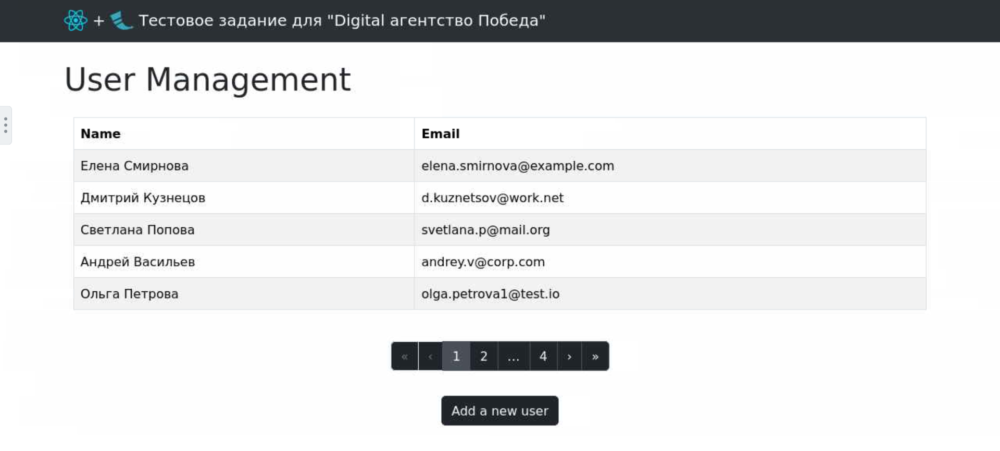
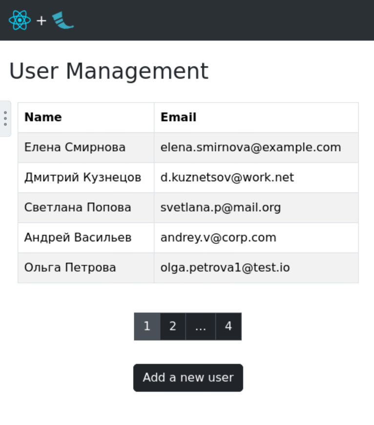
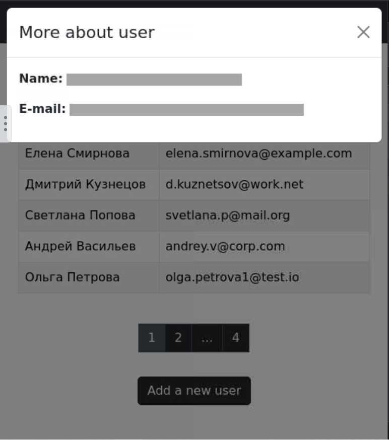
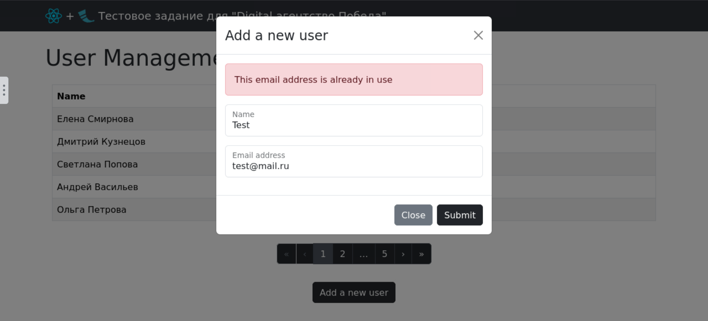

# Тестовое задание для "Digital-агентство Победа"

Это fullstack-приложение для управления пользователями, разработанное в рамках тестового задания. Приложение позволяет просматривать (с пагинацией) и добавлять пользователей.

## Стек технологий

- **Фронтенд:**
  - [React](https://reactjs.org/)
  - [React Bootstrap](https://react-bootstrap.github.io/)
  - [Axios](https://axios-http.com/)
- **Бэкенд:**
  - [Flask](https://flask.palletsprojects.com/)
  - [Flask-CORS](https://flask-cors.readthedocs.io/)
- **База данных:**
  - SQLite

## Особенности реализации

- **Вместо Vanilla JS использован React**
- **Управление состоянием через Context API:**
- Логика пагинации вынесена в переиспользуемый кастомный хук `usePagination`
- **Индикация загрузки (Skeleton UI):**
- **Обработка ошибок и разных состояний**
- **Адаптивный дизайн** - Компоненты (Navbar, Pagination) адаптируются под разные размеры экрана, скрывая второстепенные элементы на мобильных устройствах.

## Скриншоты






## Установка и запуск

### 1. Настройка бэкенда
Ссылка на бэкенд https://github.com/denis-ermolaev/flask_react_backend


Откройте терминал в корневой папке проекта.

```
# 1. Перейдите в папку с бэкендом

cd flask_react_backend

# 2. Создайте и активируйте виртуальное окружение
python -m venv .venv
# Для Windows:
# venv\Scripts\activate
# Для macOS/Linux:
# source venv/bin/activate

# 3. Установите зависимости
pip install -r requirements.txt

# 4. Инициализация BD
python database_handler.py

# 4. Запустите Flask-сервер
flask run
```

Сервер будет доступен по адресу `http://127.0.0.1:5000`!

### 2. Настройка фронтенда

Откройте **новый** терминал в корневой папке проекта.

```
# 1. Перейдите в папку с фронтендом
cd flask_react_frontend

# 2. Установите зависимости
npm install

# 3. Запустите React-приложение
npm run dev
```

## Исходное задание

> Было разрешено использовать react

### Задание 1. Бэкенд (Python)
Напишите простое веб-приложение на Flask, которое:

- Хранит в SQLite базе данных информацию о пользователях (id, имя, email)

- Имеет два эндпоинта:

/users (GET) - возвращает список всех пользователей в формате JSON

/users/<id> (GET) - возвращает пользователя по id в формате JSON

- Добавьте базовую обработку ошибок (например, если пользователя с запрошенным id не существует)

### Задание 2. Фронтенд (JavaScript)
Создайте простую HTML страницу с использованием vanilla JS, которая:

- Использует Fetch API для получения данных с эндпоинта /users вашего бэкенд приложения
- Отображает список пользователей в таблице
- По клику на пользователя показывает детальную информацию о нем в модальном окне
- Использует Bootstrap для стилизации

### Задание 3. Интеграция (Python + JavaScript)
Добавьте на фронтендную страницу возможность добавления нового пользователя через форму, которая:

- Отправляет данные на ваш бэкенд через Fetch API
- Обновляет список пользователей без перезагрузки страницы
- Показывает сообщение об успешном добавлении или ошибке